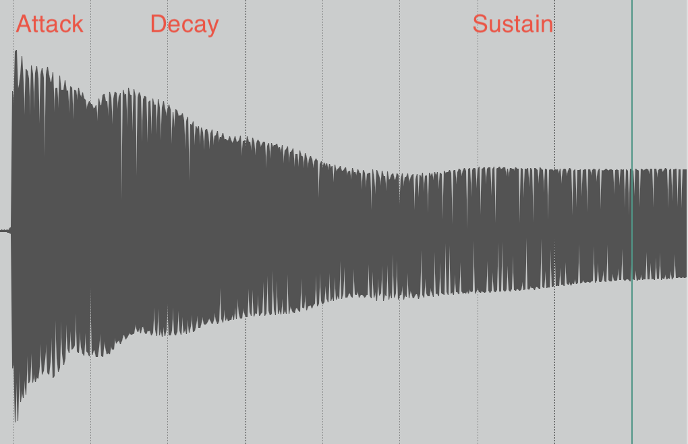
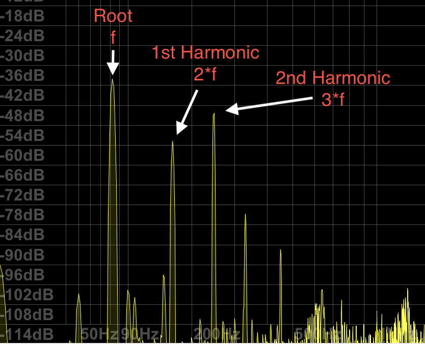
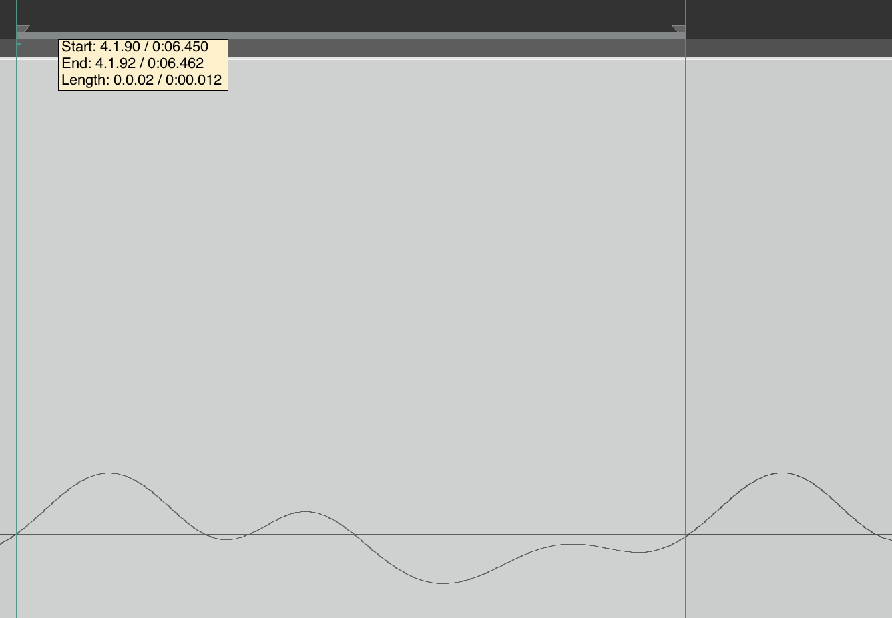
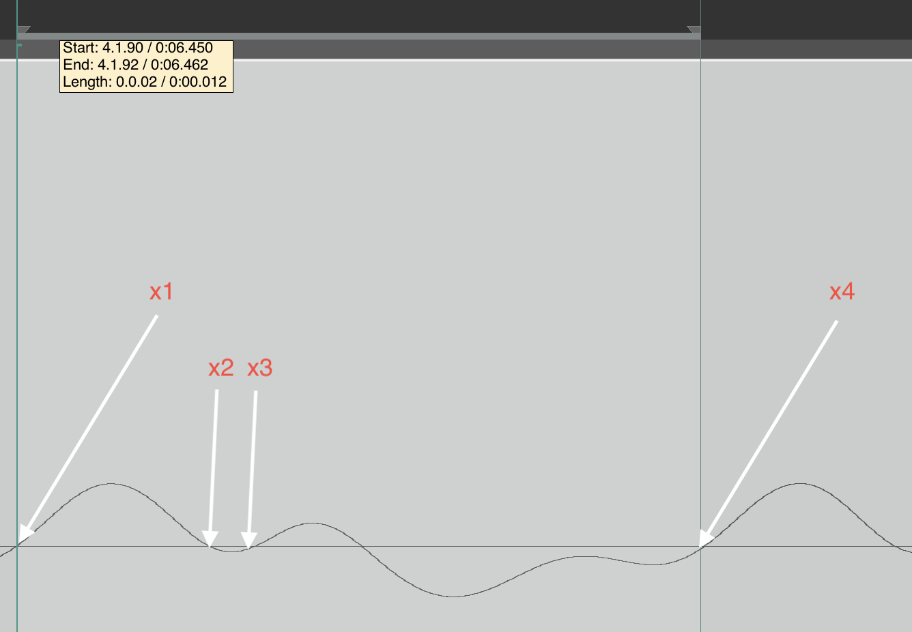
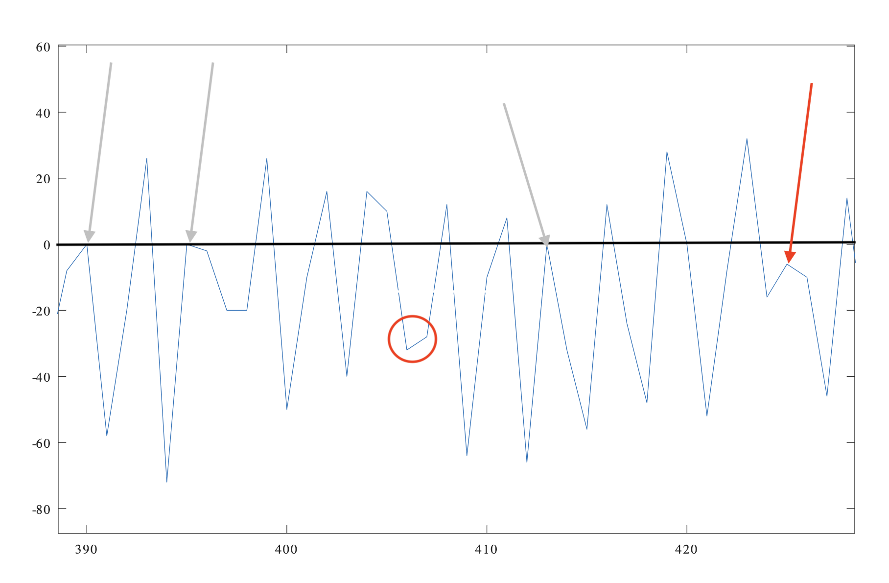
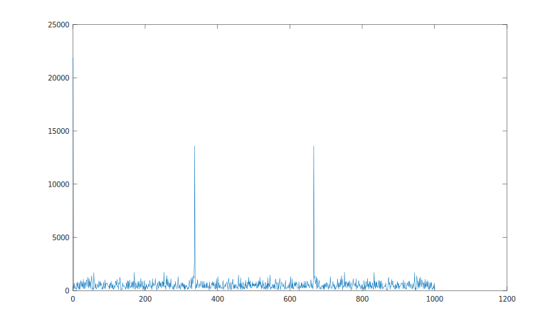

# guitar tuner 

Let's build a guitar tuner!!!

A device that helps you tune a stringed instrument (typically guitar or base). This can either be done by ear (using a pitch fork, or some other reference signal) or assisted, where some sort of device aids the player in tuning the instrument. We will focus on the latter. So the idea to provide feedback to wether a string needs to be tuned up or down to match the desired tuning (yes, a guitar/base may be tuned in different ways match the key of the song to play.) Re-tuning is needed when changing the tuning, and or the instrument goes out of tune. Thus during a session this process may be repeated numerous times which becomes tedious.

The problem can be addressed in different ways:

- Use a microphone to pick up the signal. In this category we find numerous phone apps using the built in microphone of the smartphone. This works for both electric and acoustic instruments but not very well in a noisy environment.

- Clip on device, picking up the signal from the headstock of the stringed instrument. In this category we find various battery operated tuners. These work reliably even in noisy environments as in contact with the instrument.

- Use the signal emitted by the guitar pic-up. In this category we find both hardware devices (stomp boxes) and computer software where the audio signal is captured by a sound card. The former typically is designed with a pass through so that the output can be muted while tuning. The latter is typically used more in context of computer based music production, where the audio signal is readily available.

In common they track the incoming signal to provide feedback on wether a particular string needs to be tuned up or down. Depending on implementation their performance and degree of automation varies, from the simplest approach where the user is required to provide "ballpark" information on the expected frequency (e.g., by selecting string and desired tuning), to advanced multi-timbral tuners able to detect the frequency of each string. 

Our goal here is to explore the design space and discuss potential pros and cons.

## First a bit of "String Theory"

Each note corresponds to a frequency, e.g., E2 corresponds to 82.4 Hertz in standard tuning. For a comprehensive table see [note-frequencies](https://muted.io/note-frequencies/).

Stringed instruments are typically tuned according to the frequency of the non-fretted (open) string. For a 6 string guitar this corresponds to note and (fundamental) frequencies, in (one typical tuning).   

| String  | Note  | Fundamental frequency |  
|---------|-------|-----------------------|
| 1       | E2    | 82.4                  |   
| 2       | A2    | 110.0                 |   
| 3       | D3    | 146.8                 |      
| 4       | G3    | 196.0                 |   
| 5       | B3    | 246.9                 |   
| 6       | E3    | 329.6                 |   

An octave consist of 12 semitones. The relation between notes can be expressed in cents (1/100 of a semitone) as:

 $cent = 1200 × log_2(f(n_2) / f(n_1))$
 
 where $f(n_x)$ is the frequency of note $n_x$, see e.g. [semitones-to-cents](https://www.omnicalculator.com/other/semitone#how-do-i-convert-semitones-to-cents
).

From theory a string anchored at the ends will resonate at harmonic frequencies related to the length of the string, the string material, and the tension of the string. The [Wikipedia - string vibration](https://en.wikipedia.org/wiki/String_vibration).

The root resonance (fundamental frequency), 1st and 2nd harmonics look like this:


The three constituents overlaid:


(We are deliberately a bit sloppy with the notation to keep it simple.)

By adjusting the tension we can tune the instrument (where higher tension increases the resonance frequencies).

Let's start by sampling the audio when strumming the open E2 (lowest) string, and inspect the time domain signal.



During the *Attack* the we have the strongest amplitude, but also additional noise uncorrelated to the root note frequency due to string contact. During the *Decay* the amplitude of the signal is rapidly falling off. During the *Sustain* the amplitude falls off at a lower rate. 

The envelope for the signal is the sum of the envelopes for each harmonic constituent. 

The we add energy by displacing the string (bending it). The increased tension will effect the frequency, thus the decay starts from a slightly higher pitch into the steady state frequency of the sustain. 

The harmonic envelope varies between the strings due to material gauge and winding. The audio signal is further affected by the pickup and tone control. While the variance in between tone/timbre of different instruments is huge the main wave characteristics remains, and for the purpose of tuning we can focus on the steady state of the audio signal (sustain).

An FFT with 32k bins of the sustained signal looks something like this:



As seen the root frequency $f = 82$ Hz (E2, lowest string on the guitar) is dominating, but we can also see higher frequency components, reflecting the harmonics at $n * f$, (164 Hz, 246 Hz, ...).

The corresponding signal in the time domain looks something like this:



The selection is taken over one period, shown with three digits of precision as 0.012 seconds. This corresponds to a root frequency of 83.333, which match our expectations of 82 Hz. (0.011 seconds amounts to 90 Hz, 0.013 seconds to 76 Hz, so clearly 3 digits are not sufficient).

## Approximating signal frequency

There are many ways to analyze the frequency content of a signal. 

### Fast Fourier Transform 

The Fast Fourier Transform is commonly used to split the signal into narrow equally spaced frequency bands. The process is under certain conditions reversible thus one can recreate the original frequency from its FFT. It also allows for operating on the signal in the frequency domain, used e.g., to implement advanced multi band equalization, compression etc. in a computationally effective manner.

In context of tuner implementations, it might be used in order to obtain a rough estimate of the fundamental (as seen above). Sub-bin resolution may be obtained by interpolation, but is not further explored here as we primarily seek solution for light weight implementations. So we leave FFT out, at least for now.

### Autocorrelation

Another, approach is to look at the [autocorrelation](https://en.wikipedia.org/wiki/Autocorrelation) between a window $w$ of the signal $s(t..t-w)$ and $s(t..t-w-p)$, where $p$ is the assumed period. A reasonable window size is the assumed period. By starting off from period reflecting the lowest frequency of interest and sweeping upwards we can find the first local minimum, reflecting the fundamental frequency. 

(Alternatively to computing the autocorrelation, we can compute the estimated error between the signal and the delayed signal.)

The sample by sample correlation (or error) will however be unreliable in case the number of samples period is small. This might be mitigated by computing the correlation/error over multiple periods.

### Zero crossing

Another approach is to extract properties directly from the signal. One such property is zero crossings.

For computing the period we seek the zero crossings correlated to the fundamental frequency of the signal.

Due to the physical characteristics, the fundamental and its harmonics are in phase, thus should not affect the zero crossings.

Let's re-visit the previous example (the E2 string in sustain).



Here we see that over one period of the signal we have 4 zero-crossings. 

Zero crossings can be found by any two samples having opposite signs. The time can be computed by interpolation (e.g., [Linear interpolation](https://en.wikipedia.org/wiki/Linear_interpolation), or by more advanced interpolations, e.g., [Lagrange interpolation](https://en.wikipedia.org/wiki/Lagrange_polynomial), and solve the equation for zero.

For the simple linear interpolation case the zero crossing can be computed by:

```rust
fn lerp_zero(y0: f32, y1: f32) -> f32 {
    -y0 / (y1 - y0)
}
```
The `lerp_zero` is an optimized version of the general linear interpolation equation as assuming the distance in time between`y0`and `y1` is 1. (Notice `y1` == `y0` implies UB, and would panic.)

Under the assumption that a line in between `y0` and `y1` will cross zero, then the `lerp_zero` function will return a value in between 0.0 and 1.0. 

For frequency detection it is sufficient to look at the zero crossings in one direction.

As seen in the above figure, harmonics may cause additional zero-crossings. 

If sampled at a lower rate, e.g., 1kHz, the E4 (high E string on the guitar), the fundamental frequency (330 Hz), is close the Nyquist frequency, thus the number of samples per period becomes close to two. Also in this case the signal might be affected by lower frequencies than the fundamental, due to resonance of other strings and body resonances.



Arrows in gray, indicate the situation where a zero crossing might or might not be detected, the red arrow and ring missed crossings.

We can still see that a majority of crossings could be clearly spotted. 

An FFT of the E4 sampled at 1kHz is shown below.

 

Here the FFT shows the frequency content mirrored at the Nyquist frequency (500Hz). While the signal in the time domain is messy, the FFT shows the expected signal (at around 330 Hz).

## Experiments

The autocorrelation approach is implemented in the `simple_tuner` example. This approach is suitable when sampling can be done at high rate and precision. 

The zero crossing approach is implemented in `zero_crossing_x` examples, evaluating different filtering strategies to mitigate problems. The approach is intended for very light weight devices, thus the data for analysis has been sampled at only 12 bit and 1kHz. The data acquisition code can be found in the `nrf52840/rtic_app`crate. 

## Results so far.

The autocorrelation based tracking works very well, but the initial frequency detection by sweeping may find multiples of the frequency. This needs further investigation.

The zero crossing approach does not work well out the box. Clever filtering needs to be done to avoid false crossing detection (due to harmonics) and missed crossings due to sub fundamental noise in the signal. The former can be mitigated by low pass filtering, the latter by high pass filtering.

One might also think of detecting other properties, such as the derivative of the signal. This however would require higher sampling rate and/or interpolation. The advantage is that low frequency components will not affect the result, thus reliability might be improved.


 