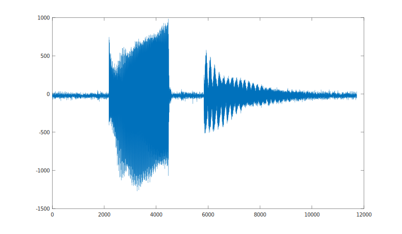
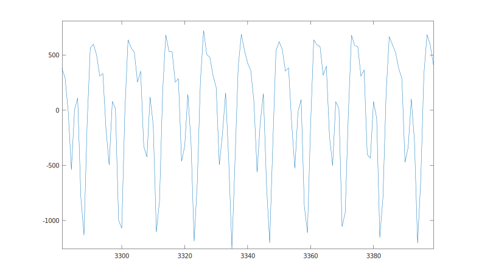
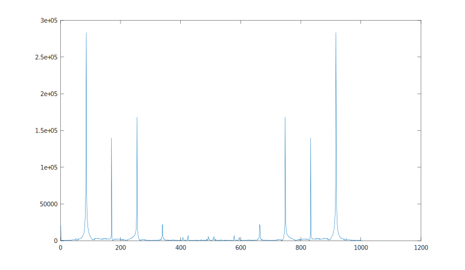
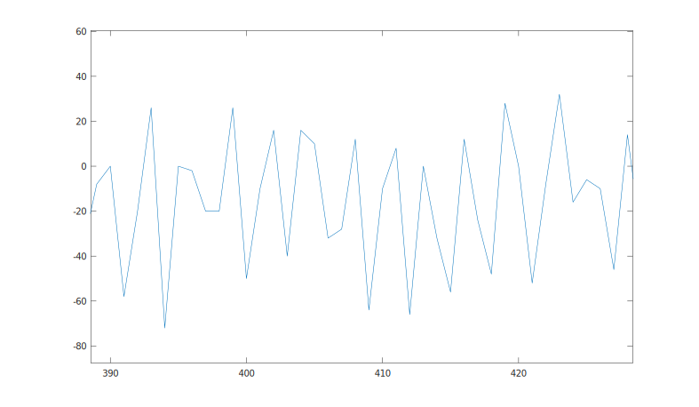
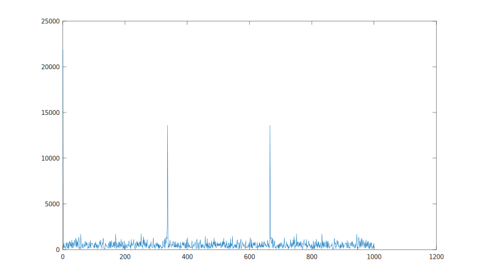

# RTIC on the nRF52840DK board

## Resources

## Setup

The guitar output is passed through a 1st order Low Pass (R/C) filter, with a cutoff (-3db) set to 330 Hz (the highest frequency we are interested in for tuning purpose). The purpose with the LP filter is to reduce aliasing when sampling (so should be well below half the sampling frequency).

## rtic_saadc_raw

In the first experiment we setup the on-board ADC to sample the signal in 12 bit differential mode at approximately 1kHz.

The samples were traced to the host and captured in a log file. This file was then loaded into octave for post processing.

For the experiment we first strummed the E2 (low E string), followed by E4 (high E string).

A plot in the time domain of the 10 seconds of data:

Zooming in on the sustain of E2.

We can clearly see that the signal is periodic, with fundamental and harmonics.

We can now take the FFT of the signal to confirm this observation.

(The plot is mirrored at 500Hz.)

The interesting peaks are found at 85, 170, 260 Hz, which confirms that we are in the right ballpark. (The sampling frequency is slightly off, but we will fix that.)

We can now have a look at the E4 (high E) in the time domain.

Once again we see that the signal is periodic, but much messier. Let's have a look at its spectrum.

This looks nice and clean despite the messy time domain plot, the single peak is found at 340 Hz, so we are in the right ballpark.

## rtic_tuner
